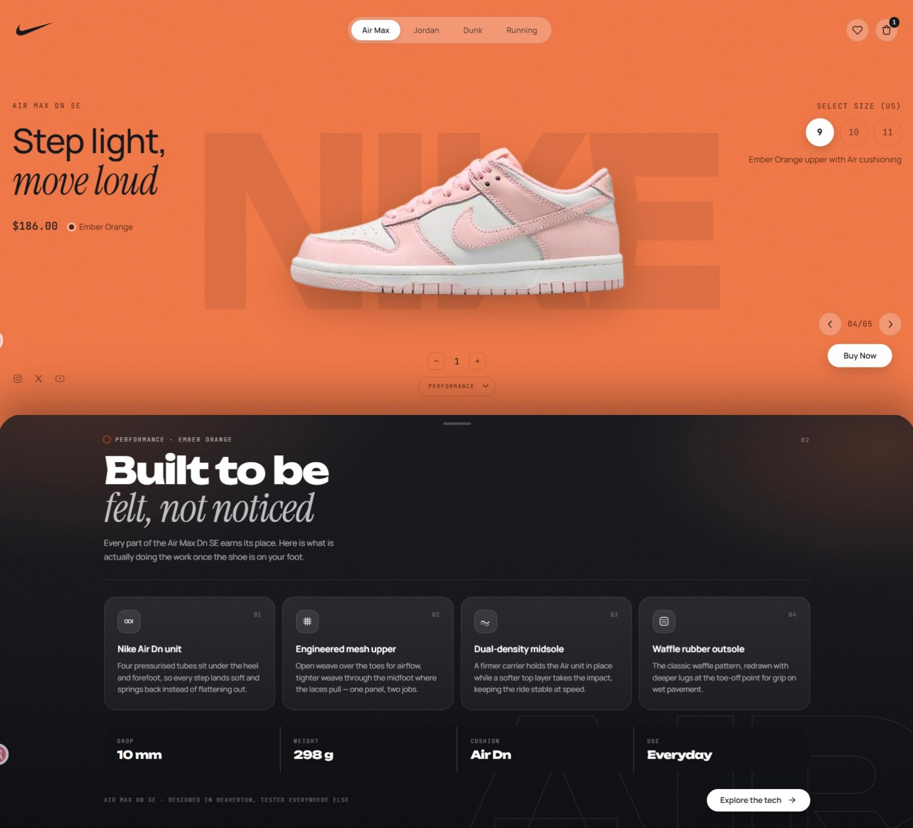

# Sneaker Stage

An animated sneaker product page. Five colourways, and the product shot flies off the edge of the screen and back on a measured arc every time you change one — written against `requestAnimationFrame` and a quadratic bezier, with no animation library.



## Demo


## Running it

```bash
npm install
npm run dev
```

Then open the URL Vite prints. `npm run build` type-checks and bundles to `dist/`, `npm run preview` serves that build, and `npm run lint` runs Oxlint.

## What's interesting in here

**One photograph, five colourways.** There is a single cut-out product shot in `src/assets`, cropped tight and stored at 1152px — twice the widest layout size, so it is only ever scaled down. Each colourway recolours it with a CSS `filter` rather than shipping its own art, which keeps the lighting and silhouette identical across the whole carousel. The rotations are derived, not eyeballed: the base photograph sits at about 210°, so Volt Green reaches 102° with `-108`, and `+158` carries the same hue the long way round to a warm 8°.

**The transition is hand-rolled.** `SneakerStage` runs one `requestAnimationFrame` loop per change. The outgoing shoe and the incoming one are on screen together, travelling different curves over different durations — 640ms out against 900ms in — so the swap overlaps rather than queuing. The incoming shoe eases along its arc for the first 55% and then hands over to a decaying-sine spring for the settle, which is where the small overshoot comes from.

**It genuinely leaves the screen.** The travel distance is measured from the shoe's real resting rect and cleared by its *half-diagonal*, because the rotation on the way out swings the corners wider than the box. It also means `.stage` must not clip its own overflow — the stage is inset by the slide's padding, so clipping there would slice the shoe a few dozen pixels short of the edge. `.slide--hero` does the clipping instead, which is exactly the viewport.

**Bow the control point sideways, not backwards.** This is the one thing worth stealing. A quadratic control point sitting near the start height while `x` has already run most of its course makes the shoe hang and then plunge — it reads as a nose-dive, not a fall. Pinning the control to the chord's own midpoint and offsetting it *laterally* curves the path without touching how evenly it loses height, so the two are independent knobs. `EXIT_BOW_X` is that offset.

**The two directions are shaped differently on purpose.** The forward exit leaves down-left with the sideways bow, swinging out past the social row. The backward exit leaves up-right on its original arc, because the bow is screen-space and not mirrored — applying it there would drag the shoe left, back across the frame it is trying to leave.

## Layout

Two slides on plain document scroll. The hero is `position: sticky` and exactly one viewport tall, so the performance panel rides up over it and a wheel scroll lands on the same stop the scroll cue animates to. No scroll hijacking.

```
src/
├── App.tsx                    colourway index, direction, cart state
├── components/
│   ├── Nav.tsx                logo, categories, cart drawer
│   ├── ProductHero.tsx        copy, size picker, controls, scroll cue
│   ├── SneakerStage.tsx       the rAF transition
│   ├── SneakerPhoto.tsx       the tinted product shot
│   └── Performance.tsx        slide 2
├── data/
│   ├── products.ts            colourways: bg, accent, tint, copy
│   └── cart.ts                lines keyed by colourway + size
└── styles/                    one stylesheet per component
```

Prices are held in cents so totals never drift on floats, and the cart keys a line by colourway *and* size, so the same shoe in two sizes is two lines.

## Accessibility

`prefers-reduced-motion` is respected throughout: the colourway change skips the flight entirely and swaps in place, the scroll cue stops looping, and the background colour transition is dropped.

Beyond motion — the product shot carries alt text naming the live colourway, the size picker is a `role="group"` of `aria-pressed` buttons, the cart drawer is a modal dialog that closes on Escape and reports its item count in its label, and every icon-only control has one.

## Built with

React 19 · TypeScript · Vite · Oxlint. No runtime dependencies beyond React.

## A note on the branding

This is a design study, not a Nike product and not affiliated with Nike in any way. The Nike name, the Swoosh and the product photography are trademarks and property of Nike, Inc., used here only as placeholder material for a non-commercial exercise in layout and motion. Swap `src/assets/sneaker.png`, the wordmark in `App.tsx` and the logo in `Nav.tsx` before using any of this for anything real.
